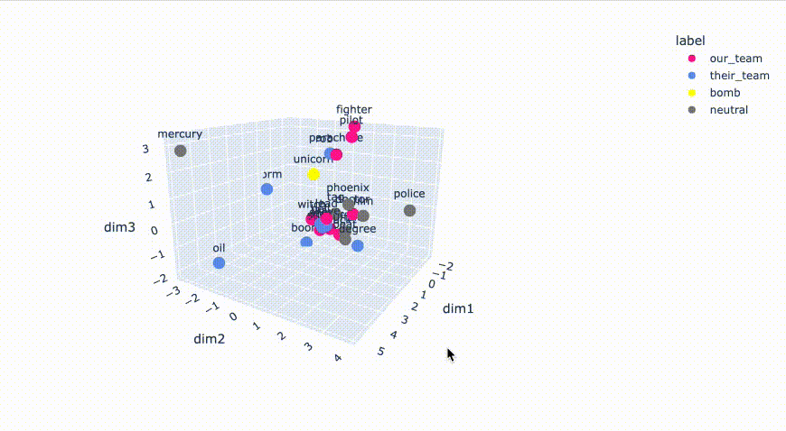

# codenames_game_AI
Play codenames with the computer! This code uses dimensionality reduction to visualize the similarity of the words in a codenames game, letting you decide which words to clue. 
It then generates a clue for you. 

## Data
The data used is in ```words/freq_words.txt```. These are the 38000 most commonly used words, taken from GloVe. Each word includes its vector in 300-d space

This file was created by getting the pretrained GloVe data and extracting the first 3800 words. It can be done with different amounts (i.e. 50K, etc)
```
wget http://nlp.stanford.edu/data/glove.42B.300d.zip
unzip glove.42B.300d.zip
head -n 38000 glove.42B.300d.txt > freq_words.txt
```
To use the notebook, edit the words for the teams to match the current board. 

## Dimensionality Reduction for Word Group Selection
First the dimensions are reduced from 300 to 3 in order to view the words in semantic space, which can be done using PCA or t-SNE, like this



You can use that visualization to help identify which of your words are clustered together. For instance, in the above visualization, 'pilot', 'fighter', and 'parachute' are a cluster.

## Clue Generation
Once you decide on a cluster of words to clue, the notebook will produce a clue that minimizes distance to your words and maximizes distance to the other words. 

For instance, minimizing distance to pilot, fighter, and parachute, and maximizing distance to all non-good words on the board results in word recommendations like 'squadron', 'maneuvers',  and 'aircraft'. 

These clues will then be replotted in 3d space with the words on the board, so you can see which of the other teams words are worth being concerned about. 
