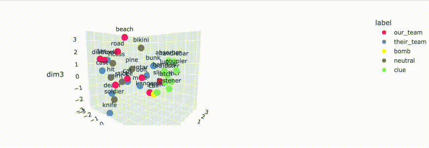

# codenames_game_AI
Play codenames with the computer! This notebook lets you use an AI to guess a word given a specific board and clue, or use AI to assist the spymaster in generating a clue.  It does the latter by using dimensionality reduction to visualize the similarity of the words in a codenames game, letting you decide which words to clue, and then generating a clue for you. 

## The game
Codenames is a team-based board game. The board consists of 25 random words. Everyone sees all the words, but only the two spymasters (one for each team), know which words belong to which team (8 for one team, 9 for the other, 7 neutral, and 1 bomb). A turn consists of the spymaster cluing words, followed by their teammate guessing which words the spymaster was trying to clue. The goal of the game is for the team to successfully guess all of the words belonging to their team before the other team successfully guesses theirs. If a team guesses the bomb, they automatically lose.

Each clue consists of a single clue word and a number indicating the number of words that clue relates to. The difficulty for the spymaster is to pick a clue word that relates more to your own team's words than to the other team's words. For instance, in the board below, the red team should be wary of giving a clue of "animal" for "cat" and "kangaroo", since "animal" may also clue "bee", "mole", or even the bomb, "calf".


The task of clue generation generally has two parts-- figuring out which words to clue, and generating a clue for them that is maximally far from the non-team words. 

## This project
This project lets the AI act as the guesser, or assist in the role of the spymaster.

For the guessers, deciding which word the spymaster was cluing involves figuring out which words are closest semantically. The first task of this code is to calculate the distance between the clue word and all the words on the board to automatically determine the words being clues. 

The spymaster knows which words belong to which team, but their role is still difficult-- you want to clue as many words as possible, but increasing the number of words you clue makes clue generation harder. This code provides AI assistance in this task. It first shows the words on the board in semantic space to help identify a good cluster of words to clue. Using that cluster, the code then generates a list of clues. 

## Data
For the representation of the words, this project uses GloVe, which maps words onto a 300-dimensional space where distance between words is related to semantic similarity. We can then perform math on the vectors representing each word to generate clues. For instance, we can calculate the distance between two words by calculating the cosine similarity between their embeddings.

The word embeddings are obtained by:

```
wget http://nlp.stanford.edu/data/glove.42B.300d.zip
unzip glove.42B.300d.zip
```
We don't need all the words here, so we can reduce the number to just the most frequent words. 38000 led to a file within file limit on github, so:

```
head -n 38000 glove.42B.300d.txt > freq_words.txt
```
## Using the notebook

There are several parts of the notebook that require editing based on the board. The three parts that should be edited given a specific turn of the game are highlighted in :large_blue_diamond: blue :large_blue_diamond:

For the guesser:
1) There is one cell to edit, in order to input the words on the board as well as the clue.

For the spymaster:
2) edit the cell that lists the words for the teams. 
3) After the visualization of the words, edit the cell to indicate which cluster of words you want to clue

The rest can be run automatically.

## Dimensionality Reduction for Word Group Selection
As described above, the first task of the spymaster is to decide which words to clue. Trying to keep track of which of your words are similar can be difficult. Here, I used dimensionality reduction to visualize the words, which can help determine which clusters of words are similar. 

This code allows for two potential techniques: Principal Components Analysis (PCA) is a common technique of reducing the dimensionality of data and can then let you visualize it in 2D or 3D space. t-distributed stochastic neighborhood embedding (t-SNE) is a different technique that may be better suited for representing word embeddings-- rather than trying to preserve the global structure of the data, it tries to preserve local structure of neighbors. It's also less sensitive to outliers. It's also non-deterministic so sometimes rerunning the cell is useful. 

To demonstrate what this does, here is an "easy" board where the words for the different teams happen to be semantically distinct (one team's words relate to royalty, the other team's words relate to coding):


In reality we are never this lucky. For instance, the board shown at the top of this Readme doc is represented by the following:


Nonetheless, this visualization can help identify good clusters of words.  For instance, the above visualization shows that "bolt", and "sling" are similar, which may not be immediately obvious. 

## Clue Generation
Once you decide on a cluster of words to clue, the notebook will produce a clue. A potential algorithm for this is provided by  https://jsomers.net/glove-codenames/ and is adapted here. It generates a list of words that minimizes distance to your team's words and maximizes distance to the other words. It does this first by finding the 250 words that maximize the the distance to the bad words, and minimize the distance to the good words. this is insufficient, though, since a candidate clue can score well if it's very close to one or two of your words but far from the other. So, we want to sort the 250 candidate clues according to those that maximize the minimum distance to the good words, and minimize the max distance to the bad words. 

This process works quite well. For instance, minimizing distance to "bolt" and "sling", and maximizing distance to all non-good words on the board results in word recommendations like "recoil" and "harness". 

These clues will then be replotted in 3d space with the words on the board, so you can see which of the other teams words are worth being concerned about.



